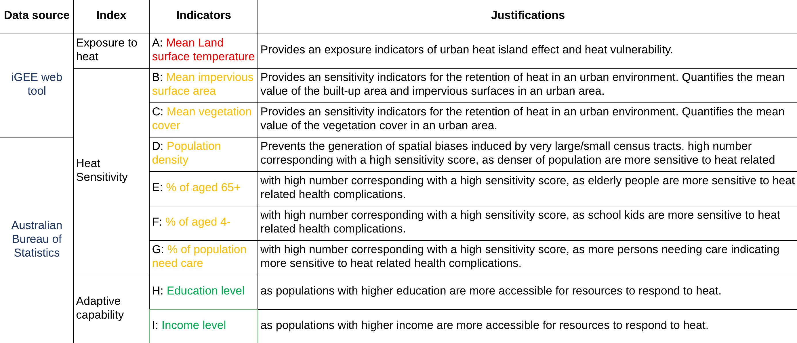
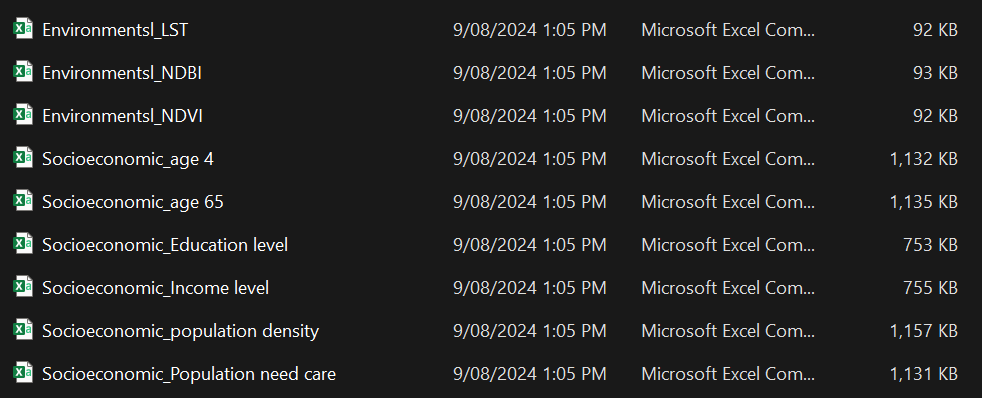
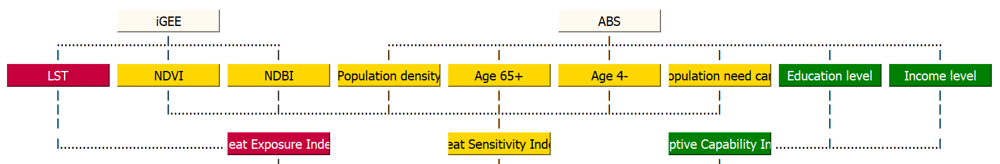
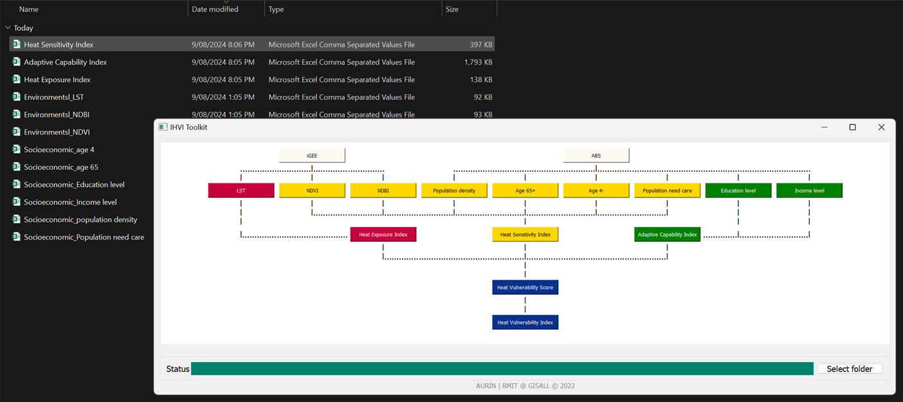
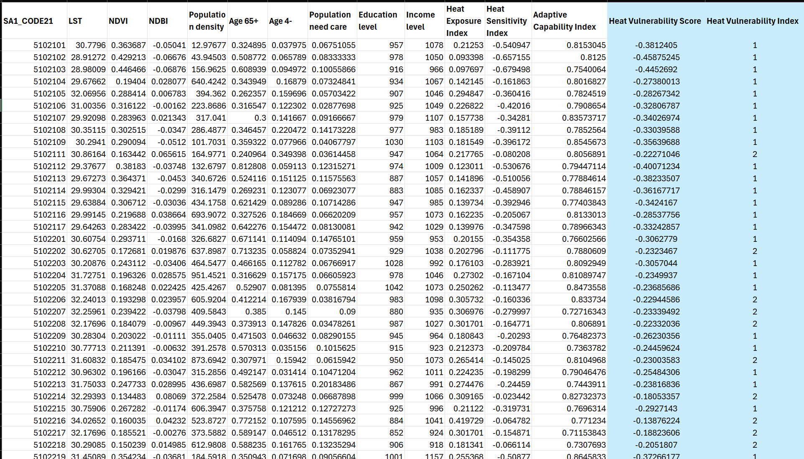

## iHVI User Manual

The iHVI system interface operates based on the [iGEE tool](http://www.gisonmeta.com) and [ABS](https://www.abs.gov.au/census) census data. Users can access the iGEE and ABS websites by clicking the buttons on the first row. 
The data input buttons are on the second row, including LST, NDVI, NDBI, Population Density, Population over 65 years old, Population less than 4 years old, Population Needs Care, Education Level, and Income Level. By default, the “|” below these buttons is “X”, indicating that the input data is empty. When users click on the second row of input buttons, they will be asked to choose files from their local file system, and the “X” will change to a “|.” The heat exposure index, heat sensitivity index, and adaptive capability index can be calculated when the correspondingly coloured input data has been filled in. If all the data is uploaded, users can click the blue buttons to calculate the heat vulnerability index and heat vulnerability score. The output destination is the same directory as the one where the iHVI desktop application is located. Users can define a different output folder by clicking on the “Select folder” button in the bottom right corner. If any errors occur during the calculation, the app will prompt the user with a warning and the user can make changes accordingly. Below image shows the iHVI tool inteface. 

## Running the iHVI tool:

1. Download the toolkit as instructed in this page https://github.com/Shinjita/iHVI-app. 

2. Obtain environmental parameters from iGEE and socio-economic indicators from ABS website in .csv format. 

3. Prepare seperate .csv files for each indicators/parameters for input. 

4. Make sure the input data have two important columns marked in red, shown in image below. For environmental parameters columns required are: SA1_CODE21 and LSTmean, SA1_CODE21 and NDVImean, SA1_CODE21 and NDBImean and For socio-economic indicators columns required are: Population Density, SA1_CODE21 and Age_65+, SA1_CODE21 and Age_4-, SA1_CODE21 and Population need care, SA1_CODE21 and Education level, SA1_CODE21 and Income level.
[Note: You can have other columns for the data and different file names but this is will not affect the process.]. One example of the file column is shown below: 

5. The data input buttons are on the second row, click on each button to upload the respective environmental and socio-economic indicator files. When  “X” changes to a “|.” it indicates all files are inputted correctly. 

6. Click on three index buttons to calculate Heat Exposure Index, Heat Sensitivity Index, and Adaptive Capability Index. Click on 'select folder' button to download the file in specific folder in CSV format. 

7. Click on Heat Vulnerability Score button and Heat Vulnerability Index button to calculate the vulnerability index for the selected SA1s. 
