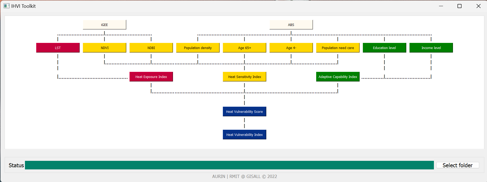

## iHVI User Manual
Method: 
The iHVI system interface operates based on the [iGEE tool](http://www.gisonmeta.com) and [ABS](https://www.abs.gov.au/census) census data. Users can access the iGEE and ABS websites by clicking the buttons on the first row. The environmental and socio-economic indicators used in the toolkit are: 

The data input buttons are on the second row, including LST, NDVI, NDBI, Population Density, Population over 65 years old, Population less than 4 years old, Population Needs Care, Education Level, and Income Level. By default, the “|” below these buttons is “X”, indicating that the input data is empty. When users click on the second row of input buttons, they will be asked to choose files from their local file system, and the “X” will change to a “|.” The heat exposure index, heat sensitivity index, and adaptive capability index can be calculated when the correspondingly coloured input data has been filled in. If all the data is uploaded, users can click the blue buttons to calculate the heat vulnerability index and heat vulnerability score. The output destination is the same directory as the one where the iHVI desktop application is located. Users can define a different output folder by clicking on the “Select folder” button in the bottom right corner. If any errors occur during the calculation, the app will prompt the user with a warning and the user can make changes accordingly. 

How to run the toolkit: 
1. Obtain environmental parameters from iGEE and socio economic indicators from ABS website in .csv format. [image info](Indicators.png)

2. Make sure to have seperate .csv files for each indicators. Check whether the file have necessary column names for the input data as shown below. [image info]() [Note: the file can have any name which will not affect the process] 

For environmental parameters (LST, NDVI, NDBI):  SA1_CODE21 and mean [image info]()

For socio-economic indicators (Population Density, Age_65+, Age_4-, Population need care, Education level, Income level) [image info]()

3. The data input buttons are on the second row, click on each button to upload the respective environmental and socio-economic csv files. [image info]()

4. 
